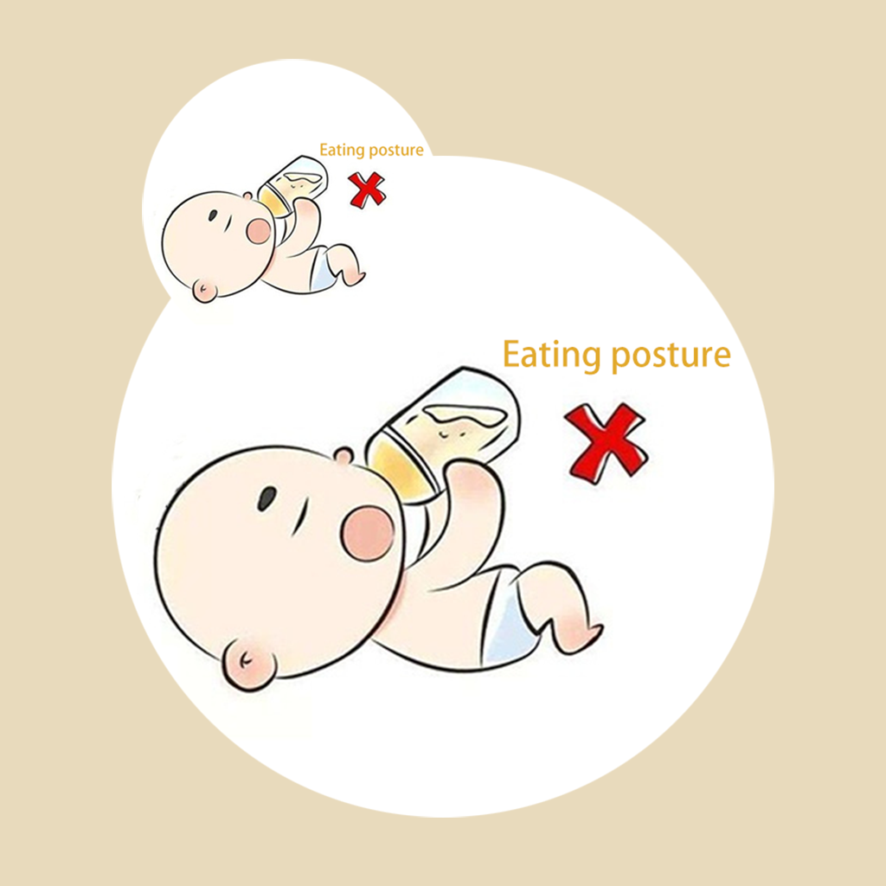

## Welcome to Baby Wrong Eat Posture Record

The baby's wrong eating posture is bad for the baby's digestion and health. As parents, we need to pay close attention to our baby's daily eating posture and behavior. When the baby appears wrong eating posture or behavior, should correct the baby in time. You can use the app to record your baby's wrong posture and food type in daily eating. You can also record how often and how badly your baby feels about the wrong position or behavior. You can put these records together to help your baby get rid of the wrong eating positions and grow healthily.

If you have any questions, you can either leave a message or send the questions to our email address.

We will answer them for you in the first time.

### Address: jichungan9498@163.com

Thank you!
